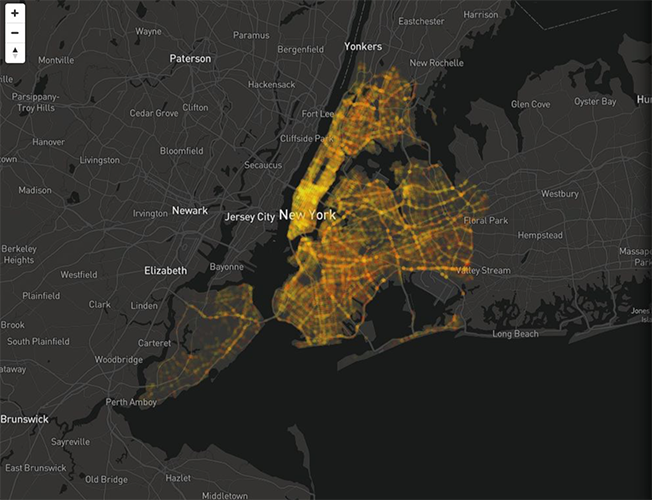
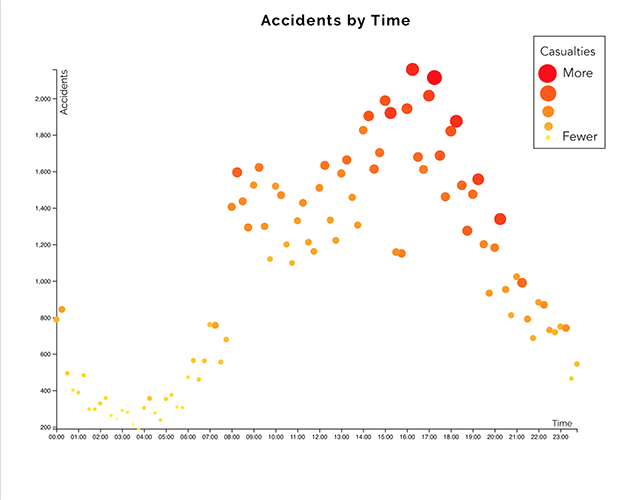
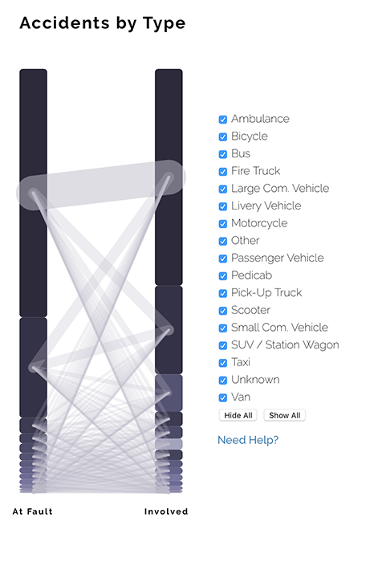

# Danger! A Collision Visualization
In collaboration with [Schuyler Alschuler](https://github.com/swalschuler) and Anthony Liu.

### Dataset : NYPD Motor Vehicle Collisions
In this dataset provided by NYC Open Data*, there are 29 columns that precisely describe each reported motor vehicle collision in NYC from 2014 until today. As a brief overview, some columns that will be highlighted in this project are: geo-coordinates for each collision; injuries of motorists, cyclists, and pedestrians; and the types of vehicles involved.

### Initial Visualization Ideas
In the proposal for this project, three view ideas were discussed: a map, a scatterplot, and a stacked graph. First, the map was to display circular marks, with opacity, density, and color channels to represent accident frequency and lethality. This way, the user would be able to see an overarching representation of the data outside of abstracted graphs and charts. Second, to present the number of accidents during different times of the day, a scatterplot with dynamically sized points was proposed. Each point’s position would indicate the frequency of accidents for a specific period of time, while its size would indicate the number of casualties at that time. For the last view, a more interesting approach was desired - a stacked graph. Two stacked bars would show the number of accidents by vehicle type; the first bar marked as the vehicle which caused the accident, and the second as vehicles affected by the accident.

### The Final Product Description : Overview
The initial view of the project shows a large view of the map, with a small portion of the screen occupied by the graph. Users can scroll to see the rest of the graph and the scatterplot.

### The Development Process : Overview
To put the three visualization together, some rough sketches were done on paper. Originally, each visualization was planned to take up one third of the page, but that did not allow each visualization enough room. Another view which was considered was a full screen map, with the other visualizations used as overlays; this method eliminated the desired initial overview of the data. Finally, we used photoshop to simulate the system’s interactions and arrived at the scrolling card view used in the final product.

### The Final Product Description : Map

The final version of the map includes all of the same marks and channels laid out in the proposal: point density indicates frequency of accidents, and the color scale displays the lethality of each accident. As such, hazardous areas are easily determined by a denser, redder area on the map. This visualization can be interacted with through zooming, panning, and drawing bounding boxes that filter the other visualizations.

### The Development Process : Map
In the initial proposal, the idea was brought up of filtering by NY boroughs, which would show and hide markers on the map, as well as filter the other views. After playing with this implementation alongside a bounding box, it was discovered that that user-defined bounding boxes performed faster, and allowed for increased user exploration. Additionally, due to the sheer number of points displayed on the map, hiding them on a district selection induced a significant delay. As such, the bounding box was used. Other aspects of the map were implemented as planned.

### The Final Product Description : Scatterplot

The final version of the scatterplot displays one point for each fifteen minute interval throughout the day. Each point is positioned to indicate the frequency of accidents during a particular time, and given a size and color to indicate the number of casualties. To interact with this graph, a user can hover the mouse over a point in order to display a bar chart. This bar chart represents the breakdown of casualties at the selected point in time. Also, this scatterplot is filtered by the bounding box drawn on the map - taking into account only data points which have geocoordinates within the selected region.

### The Development Process : Scatterplot
While developing the scatterplot, only one major change was made to the proposed design: the addition of the tooltip bar chart. While the visualization was useful without the bar chart, it left users with no way way of digging deeper into the data. By adding it, users are able to find new and interesting connections between time, location, and injury rates. The idea of plotting each time, without aggregating by fifteen minute intervals, was tried, but this method made the chart very difficult to read, and furthermore revealed fewer trends in the data.

### The Final Product Description : Graph

The final version of the graph displays two stacked bars which show the number of accidents by vehicle type; the first bar is the vehicle which caused the accident, and the second bar is the vehicle affected by the accident. Connections between the two bars, coupled with their weights, represent the frequency of collisions between the two vehicle types. Users can utilize the provided checkboxes to select any combination of vehicle types to visualize. Importantly, the graph is filtered by the bounding box drawn on the map. Animations are used during these filtering processes so that users can track how their inputs are affecting the system

### The Development Process : Stacked Graph
While developing the graph, a few major changes were made to its initial design. The biggest of these changes was centered around its interactions. At first, the graph was planned to have a click based interaction, wherein a user could click any of the vehicle types nodes and see only the edges which were related to the selection. However, while developing, it quickly became clear that this interaction was not particularly helpful; even after such filtering, the number of edges visible on the graph was overwhelming, and no useful information could be gleaned. As an alternative, a set of checkboxes was added to the interface which allows users to select any combination of vehicle types to visualize. This shift was a positive one for the graph as it allows more robust user exploration of the data - by selecting only a few vehicle types, interesting relationships can be found in the data which would otherwise remain hidden. Another important change to this visualization which came about during its development is the fact that vehicle type node size is used to encode the number of accidents a particular vehicle type is involved in. This change allows the user to, at a glance, determine which types of vehicles are involved in the most accidents.
